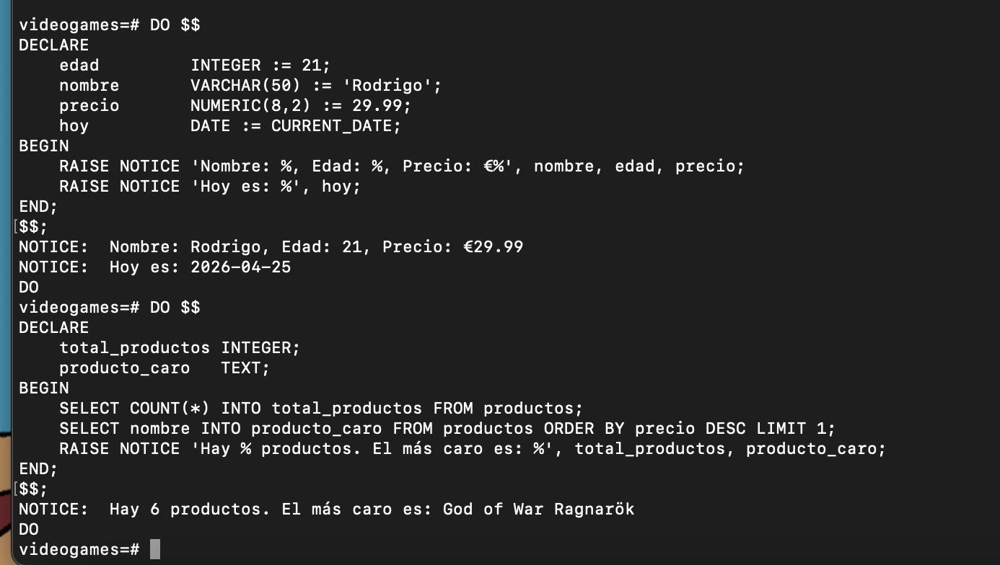
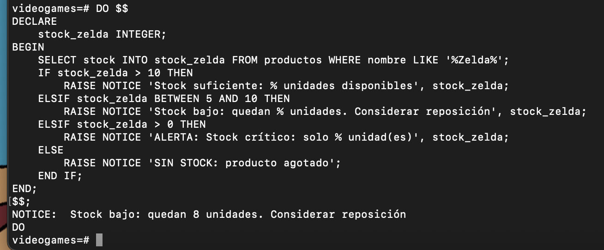
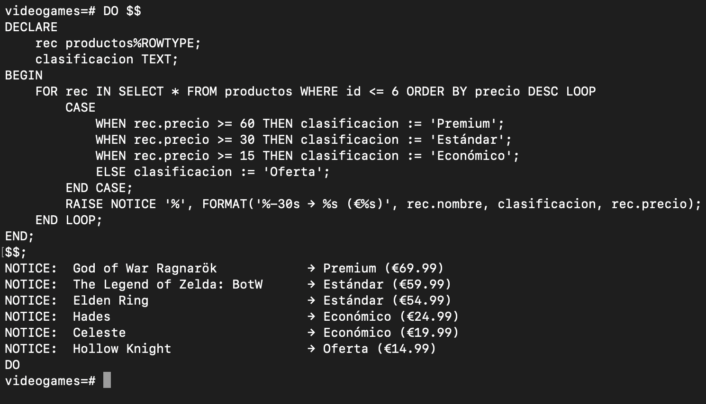
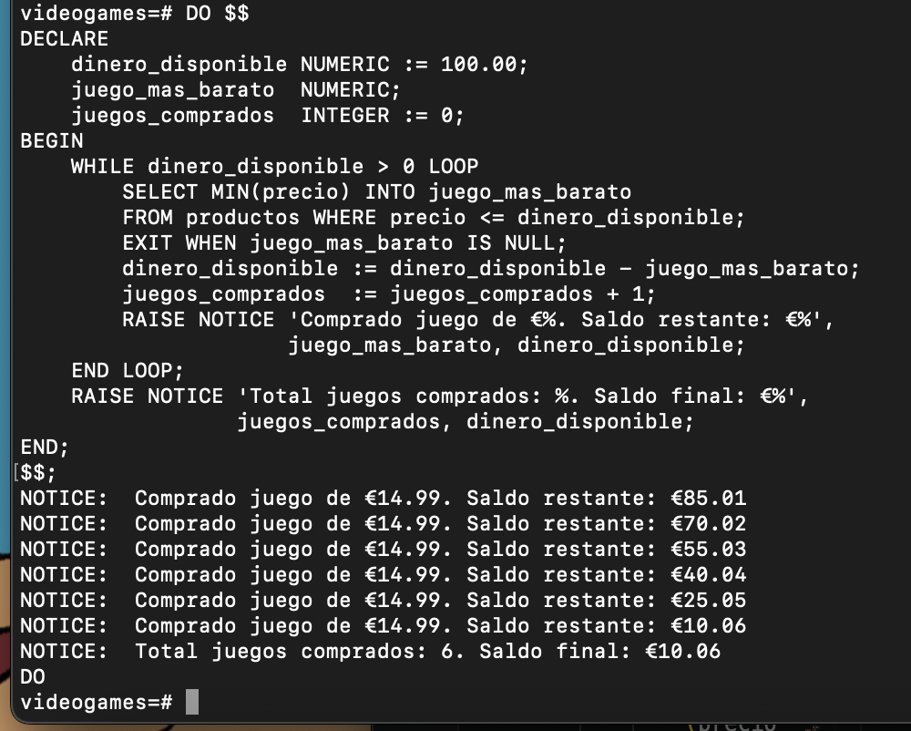
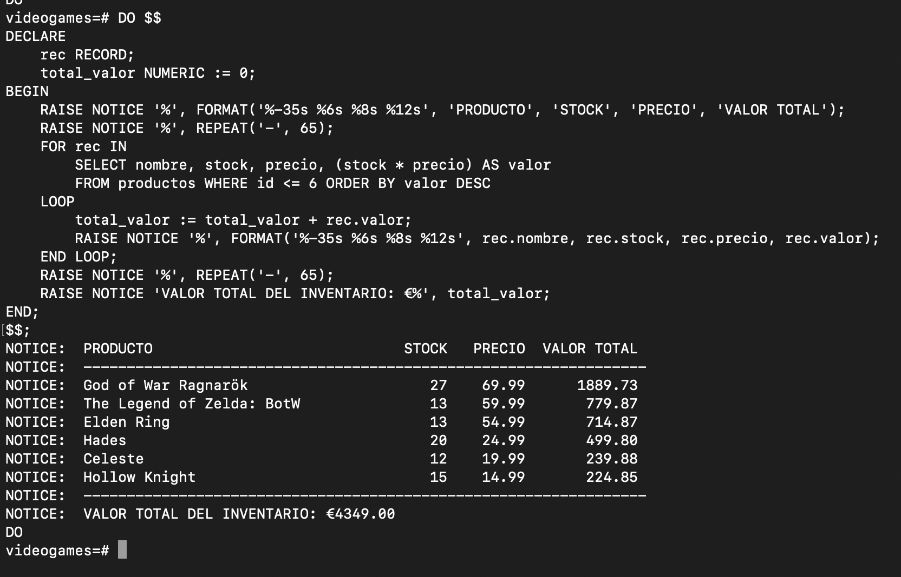
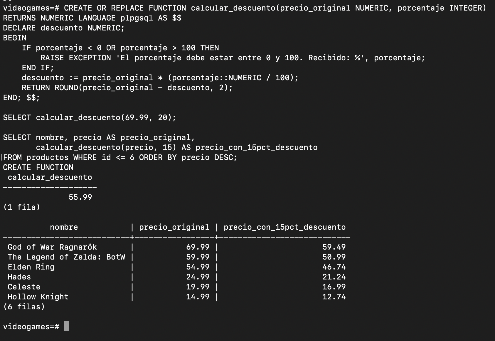
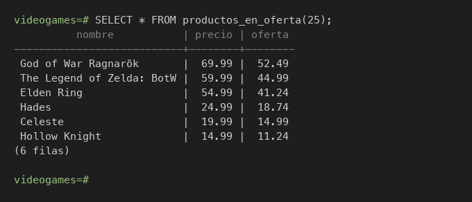
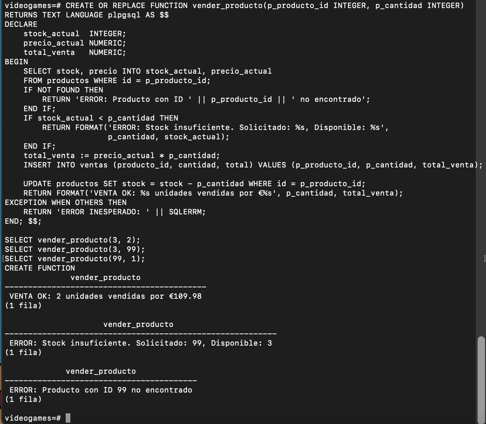
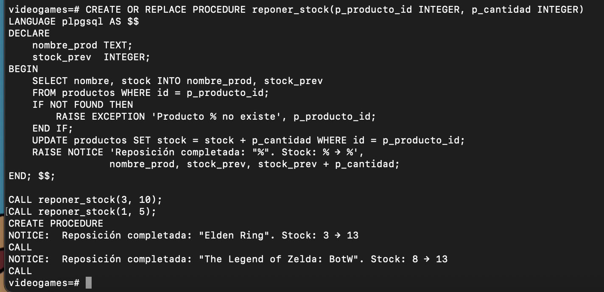
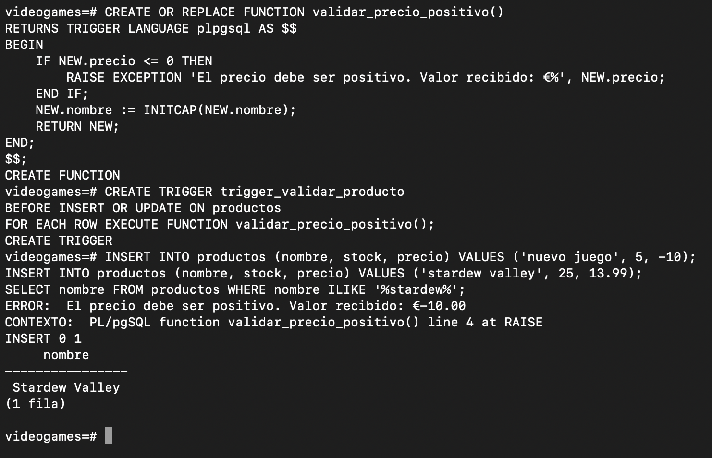

# Programación en PostgreSQL — PL/pgSQL
## Variables, Condicionales, Bucles, Funciones, Procedimientos y Triggers

---

## 1. ¿Por qué programar dentro de la base de datos?

Cuando escribimos lógica de negocio en el servidor de bases de datos en lugar de en la aplicación, obtenemos ventajas que no son obvias a primera vista. Aquí explicamos cada una:

### 1.1 Ventajas de la programación a nivel de base de datos

| Ventaja | Explicación |
|---------|-------------|
| **Rendimiento** | El código se ejecuta donde están los datos, sin transferir miles de filas a la aplicación para procesarlas. |
| **Reutilización** | Una función creada en PostgreSQL puede ser llamada desde Python, Java, PHP, o cualquier herramienta sin duplicar código. |
| **Seguridad** | Podemos dar permisos para ejecutar una función sin exponer las tablas directamente. |
| **Consistencia** | La lógica de negocio está en un solo lugar. Si cambia, se cambia una vez y afecta a todos. |
| **Triggers** | Permiten reaccionar automáticamente a cambios en los datos (INSERT, UPDATE, DELETE) sin que la aplicación tenga que recordar hacerlo. |
| **Integridad** | Se pueden implementar reglas de negocio complejas que van más allá de los simples `CHECK` o `FOREIGN KEY`. |

### 1.2 El lenguaje: PL/pgSQL

PostgreSQL incluye un lenguaje de procedimientos llamado **PL/pgSQL** (Procedural Language / PostgreSQL). Es una extensión de SQL con estructuras de control propias de la programación: variables, condicionales, bucles y manejo de errores.

---

## 2. Estructura base de un bloque PL/pgSQL

Todo el código PL/pgSQL tiene la misma estructura básica:

```sql
DO $$
DECLARE
    -- Aquí declaramos las variables
    mi_variable  INTEGER;
    otro_valor   TEXT := 'Hola';
BEGIN
    -- Aquí va el código que se ejecuta
    mi_variable := 42;
    RAISE NOTICE 'El valor es: %', mi_variable;
END;
$$;
```

> `DO $$...$$;` ejecuta un bloque anónimo (sin nombre). Para crear funciones reutilizables usamos `CREATE FUNCTION`, que veremos más adelante.

> `RAISE NOTICE` es la forma de "imprimir" en PostgreSQL, equivalente a un `print()` o `console.log()`.

**Salida:**
```
NOTICE:  El valor es: 42
DO
```

---

## 3. Variables y tipos de datos

### 3.1 Declaración de variables

```sql
DO $$
DECLARE
    -- Tipos básicos
    edad         INTEGER := 21;
    nombre       VARCHAR(50) := 'Rodrigo';
    precio       NUMERIC(8,2) := 29.99;
    activo       BOOLEAN := TRUE;
    hoy          DATE := CURRENT_DATE;
    ahora        TIMESTAMP := NOW();

    -- Variable que toma el tipo de una columna
    stock_actual productos.stock%TYPE;

    -- Variable que toma la forma de una fila entera
    un_producto  productos%ROWTYPE;
BEGIN
    RAISE NOTICE 'Nombre: %, Edad: %, Precio: €%', nombre, edad, precio;
    RAISE NOTICE 'Hoy es: %', hoy;
END;
$$;
```

**Salida:**
```
NOTICE:  Nombre: Rodrigo, Edad: 21, Precio: €29.99
NOTICE:  Hoy es: 2026-04-26
DO
```

### 3.2 Asignar resultado de una consulta a una variable

```sql
DO $$
DECLARE
    total_productos INTEGER;
    producto_caro   TEXT;
BEGIN
    SELECT COUNT(*) INTO total_productos FROM productos;
    SELECT nombre INTO producto_caro FROM productos ORDER BY precio DESC LIMIT 1;

    RAISE NOTICE 'Hay % productos. El más caro es: %', total_productos, producto_caro;
END;
$$;
```

**Salida:**
```
NOTICE:  Hay 6 productos. El más caro es: God of War Ragnarök
DO
```

---



---

## 4. Condicionales — IF / ELSIF / ELSE

### 4.1 Estructura IF básica

```sql
DO $$
DECLARE
    stock_zelda INTEGER;
BEGIN
    SELECT stock INTO stock_zelda FROM productos WHERE nombre LIKE '%Zelda%';

    IF stock_zelda > 10 THEN
        RAISE NOTICE 'Stock suficiente: % unidades disponibles', stock_zelda;
    ELSIF stock_zelda BETWEEN 5 AND 10 THEN
        RAISE NOTICE 'Stock bajo: quedan % unidades. Considerar reposición', stock_zelda;
    ELSIF stock_zelda > 0 THEN
        RAISE NOTICE 'ALERTA: Stock crítico: solo % unidad(es)', stock_zelda;
    ELSE
        RAISE NOTICE 'SIN STOCK: producto agotado';
    END IF;
END;
$$;
```

Con el stock actual de 8 tras nuestra venta anterior:
```
NOTICE:  Stock bajo: quedan 8 unidades. Considerar reposición
DO
```

---



---

### 4.2 CASE — el "switch" de PostgreSQL

`CASE` evalúa una expresión contra múltiples valores posibles. Es más limpio que muchos `IF/ELSIF` seguidos.

```sql
DO $$
DECLARE
    rec productos%ROWTYPE;
    clasificacion TEXT;
BEGIN
    FOR rec IN SELECT * FROM productos WHERE id <= 6 ORDER BY precio DESC LOOP
        CASE
            WHEN rec.precio >= 60 THEN clasificacion := 'Premium';
            WHEN rec.precio >= 30 THEN clasificacion := 'Estándar';
            WHEN rec.precio >= 15 THEN clasificacion := 'Económico';
            ELSE                       clasificacion := 'Oferta';
        END CASE;

        RAISE NOTICE '%', FORMAT('%-30s → %s (€%s)', rec.nombre, clasificacion, rec.precio);
    END LOOP;
END;
$$;
```

**Salida:**
```
NOTICE:  God of War Ragnarök            → Premium (€69.99)
NOTICE:  The Legend of Zelda: BotW      → Estándar (€59.99)
NOTICE:  Elden Ring                     → Estándar (€54.99)
NOTICE:  Hades                          → Económico (€24.99)
NOTICE:  Celeste                        → Económico (€19.99)
NOTICE:  Hollow Knight                  → Oferta (€14.99)
DO
```

---



---

## 5. Bucles — LOOP, WHILE, FOR

### 5.1 LOOP básico con EXIT

Un bucle que se repite indefinidamente hasta que una condición activa `EXIT`.

```sql
DO $$
DECLARE
    contador INTEGER := 1;
BEGIN
    LOOP
        RAISE NOTICE 'Iteración número: %', contador;
        contador := contador + 1;

        EXIT WHEN contador > 5;  -- Sale del bucle cuando contador supera 5
    END LOOP;

    RAISE NOTICE 'Bucle finalizado. Contador final: %', contador;
END;
$$;
```

**Salida:**
```
NOTICE:  Iteración número: 1
NOTICE:  Iteración número: 2
NOTICE:  Iteración número: 3
NOTICE:  Iteración número: 4
NOTICE:  Iteración número: 5
NOTICE:  Bucle finalizado. Contador final: 6
DO
```

### 5.2 WHILE

El clásico bucle que se ejecuta mientras una condición sea verdadera.

```sql
DO $$
DECLARE
    dinero_disponible NUMERIC := 100.00;
    juego_mas_barato  NUMERIC;
    juegos_comprados  INTEGER := 0;
BEGIN
    -- ¿Cuántos juegos puedo comprar con 100€ empezando por el más barato?
    WHILE dinero_disponible > 0 LOOP
        SELECT MIN(precio) INTO juego_mas_barato
        FROM productos
        WHERE precio <= dinero_disponible;

        EXIT WHEN juego_mas_barato IS NULL;  -- No quedan juegos asequibles

        dinero_disponible := dinero_disponible - juego_mas_barato;
        juegos_comprados  := juegos_comprados + 1;

        RAISE NOTICE 'Comprado juego de €%. Saldo restante: €%',
                     juego_mas_barato, dinero_disponible;
    END LOOP;

    RAISE NOTICE 'Total juegos comprados: %. Saldo final: €%',
                 juegos_comprados, dinero_disponible;
END;
$$;
```

**Salida:**
```
NOTICE:  Comprado juego de €14.99. Saldo restante: €85.01
NOTICE:  Comprado juego de €14.99. Saldo restante: €70.02
NOTICE:  Comprado juego de €14.99. Saldo restante: €55.03
NOTICE:  Comprado juego de €14.99. Saldo restante: €40.04
NOTICE:  Comprado juego de €14.99. Saldo restante: €25.05
NOTICE:  Comprado juego de €14.99. Saldo restante: €10.06
NOTICE:  Total juegos comprados: 6. Saldo final: €10.06
DO
```

---



---

### 5.3 FOR — iterar sobre un rango numérico

```sql
DO $$
BEGIN
    FOR i IN 1..6 LOOP
        RAISE NOTICE 'Procesando producto ID: %', i;
    END LOOP;
END;
$$;
```

**Salida:**
```
NOTICE:  Procesando producto ID: 1
NOTICE:  Procesando producto ID: 2
NOTICE:  Procesando producto ID: 3
NOTICE:  Procesando producto ID: 4
NOTICE:  Procesando producto ID: 5
NOTICE:  Procesando producto ID: 6
DO
```

> El bucle `FOR i IN 1..6` recorre el rango de enteros del 1 al 6 de forma automática. La variable `i` se incrementa en 1 en cada iteración sin necesidad de hacerlo manualmente.

### 5.4 FOR — iterar sobre resultados de una consulta (el más útil)

```sql
DO $$
DECLARE
    rec RECORD;
    total_valor NUMERIC := 0;
BEGIN
    RAISE NOTICE '%', FORMAT('%-35s %6s %8s %12s', 'PRODUCTO', 'STOCK', 'PRECIO', 'VALOR TOTAL');
    RAISE NOTICE '%', REPEAT('-', 65);

    FOR rec IN
        SELECT nombre, stock, precio, (stock * precio) AS valor
        FROM productos
        WHERE id <= 6
        ORDER BY valor DESC
    LOOP
        total_valor := total_valor + rec.valor;
        RAISE NOTICE '%', FORMAT('%-35s %6s %8s %12s',
                     rec.nombre, rec.stock, rec.precio, rec.valor);
    END LOOP;

    RAISE NOTICE '%', REPEAT('-', 65);
    RAISE NOTICE 'VALOR TOTAL DEL INVENTARIO: €%', total_valor;
END;
$$;
```

**Salida:**
```
NOTICE:  PRODUCTO                             STOCK   PRECIO  VALOR TOTAL
NOTICE:  -----------------------------------------------------------------
NOTICE:  God of War Ragnarök                     27    69.99      1889.73
NOTICE:  The Legend of Zelda: BotW               13    59.99       779.87
NOTICE:  Elden Ring                              13    54.99       714.87
NOTICE:  Hades                                   20    24.99       499.80
NOTICE:  Celeste                                 12    19.99       239.88
NOTICE:  Hollow Knight                           15    14.99       224.85
NOTICE:  -----------------------------------------------------------------
NOTICE:  VALOR TOTAL DEL INVENTARIO: €4349.00
DO
```

---



---

## 6. Funciones — CREATE FUNCTION

Las funciones en PostgreSQL son bloques de código con nombre que reciben parámetros y devuelven un valor. Se pueden usar directamente en consultas SQL.

### 6.1 Función simple que devuelve un valor

```sql
CREATE OR REPLACE FUNCTION calcular_descuento(
    precio_original NUMERIC,
    porcentaje      INTEGER
)
RETURNS NUMERIC
LANGUAGE plpgsql
AS $$
DECLARE
    descuento NUMERIC;
BEGIN
    IF porcentaje < 0 OR porcentaje > 100 THEN
        RAISE EXCEPTION 'El porcentaje debe estar entre 0 y 100. Recibido: %', porcentaje;
    END IF;

    descuento := precio_original * (porcentaje::NUMERIC / 100);
    RETURN ROUND(precio_original - descuento, 2);
END;
$$;
```

**Uso:**
```sql
SELECT calcular_descuento(69.99, 20);
```

```
 calcular_descuento
--------------------
              55.99
(1 row)
```

```sql
-- Usarla en una consulta real
SELECT
    nombre,
    precio AS precio_original,
    calcular_descuento(precio, 15) AS precio_con_15pct_descuento
FROM productos
ORDER BY precio DESC;
```

```
           nombre            | precio_original | precio_con_15pct_descuento
-----------------------------+-----------------+----------------------------
 God of War Ragnarök         |           69.99 |                      59.49
 The Legend of Zelda: BotW   |           59.99 |                      50.99
 Elden Ring                  |           54.99 |                      46.74
 Hades                       |           24.99 |                      21.24
 Celeste                     |           19.99 |                      16.99
 Hollow Knight               |           14.99 |                      12.74
(6 rows)
```

---



---

### 6.2 Función que devuelve una tabla (RETURNS TABLE)

```sql
CREATE OR REPLACE FUNCTION productos_en_oferta(porcentaje_minimo INTEGER)
RETURNS TABLE(
    nombre   TEXT,
    precio   NUMERIC,
    oferta   NUMERIC
)
LANGUAGE plpgsql
AS $$
BEGIN
    RETURN QUERY
        SELECT
            p.nombre::TEXT,
            p.precio,
            calcular_descuento(p.precio, porcentaje_minimo)
        FROM productos p
        ORDER BY p.precio DESC;
END;
$$;
```

**Uso:**
```sql
SELECT * FROM productos_en_oferta(25);
```

```
           nombre            | precio | oferta
-----------------------------+--------+--------
 God of War Ragnarök         |  69.99 |  52.49
 The Legend of Zelda: BotW   |  59.99 |  44.99
 Elden Ring                  |  54.99 |  41.24
 Hades                       |  24.99 |  18.74
 Celeste                     |  19.99 |  14.99
 Hollow Knight               |  14.99 |  11.24
(6 rows)
```

---



---

### 6.3 Función con manejo de errores (EXCEPTION)

```sql
CREATE OR REPLACE FUNCTION vender_producto(
    p_producto_id INTEGER,
    p_cantidad    INTEGER
)
RETURNS TEXT
LANGUAGE plpgsql
AS $$
DECLARE
    stock_actual  INTEGER;
    precio_actual NUMERIC;
    total_venta   NUMERIC;
BEGIN
    -- Verificamos que el producto existe
    SELECT stock, precio INTO stock_actual, precio_actual
    FROM productos
    WHERE id = p_producto_id;

    IF NOT FOUND THEN
        RETURN 'ERROR: Producto con ID ' || p_producto_id || ' no encontrado';
    END IF;

    -- Verificamos stock suficiente
    IF stock_actual < p_cantidad THEN
        RETURN FORMAT('ERROR: Stock insuficiente. Solicitado: %s, Disponible: %s',
                      p_cantidad, stock_actual);
    END IF;

    -- Realizamos la venta dentro de una transacción implícita
    total_venta := precio_actual * p_cantidad;

    INSERT INTO ventas (producto_id, cantidad, total)
    VALUES (p_producto_id, p_cantidad, total_venta);

    UPDATE productos SET stock = stock - p_cantidad
    WHERE id = p_producto_id;

    RETURN FORMAT('VENTA OK: %s unidades vendidas por €%s', p_cantidad, total_venta);

EXCEPTION
    WHEN OTHERS THEN
        RETURN 'ERROR INESPERADO: ' || SQLERRM;
END;
$$;
```

**Uso:**
```sql
SELECT vender_producto(3, 2);   -- Venta correcta
SELECT vender_producto(3, 99);  -- Stock insuficiente
SELECT vender_producto(99, 1);  -- Producto inexistente
```

```
              vender_producto
-------------------------------------------
 VENTA OK: 2 unidades vendidas por €109.98
(1 row)

              vender_producto
-------------------------------------------
 ERROR: Stock insuficiente. Solicitado: 99, Disponible: 3
(1 row)

              vender_producto
-------------------------------------------
 ERROR: Producto con ID 99 no encontrado
(1 row)
```

---



---

## 7. Procedimientos — CREATE PROCEDURE

Los procedimientos son similares a las funciones pero **no devuelven un valor** y pueden gestionar sus propias transacciones. Se llaman con `CALL`.

Para demostrar el requisito de **operaciones sobre varias tablas**, el procedimiento actualiza el stock en `productos` y simultáneamente registra cada reposición en la tabla auxiliar `log_reposiciones`.

### Tabla auxiliar de historial de reposiciones

```sql
CREATE TABLE log_reposiciones (
    id            SERIAL PRIMARY KEY,
    producto_id   INTEGER REFERENCES productos(id),
    cantidad      INTEGER NOT NULL,
    stock_antes   INTEGER NOT NULL,
    stock_despues INTEGER NOT NULL,
    fecha         TIMESTAMP DEFAULT NOW()
);
```

```
CREATE TABLE
```

### Procedimiento reponer_stock

```sql
CREATE OR REPLACE PROCEDURE reponer_stock(
    p_producto_id INTEGER,
    p_cantidad    INTEGER
)
LANGUAGE plpgsql
AS $$
DECLARE
    nombre_prod   TEXT;
    stock_prev    INTEGER;
BEGIN
    SELECT nombre, stock INTO nombre_prod, stock_prev
    FROM productos WHERE id = p_producto_id;

    IF NOT FOUND THEN
        RAISE EXCEPTION 'Producto % no existe', p_producto_id;
    END IF;

    -- Tabla 1: actualizar el stock en productos
    UPDATE productos SET stock = stock + p_cantidad
    WHERE id = p_producto_id;

    -- Tabla 2: registrar el movimiento en log_reposiciones
    INSERT INTO log_reposiciones (producto_id, cantidad, stock_antes, stock_despues)
    VALUES (p_producto_id, p_cantidad, stock_prev, stock_prev + p_cantidad);

    RAISE NOTICE 'Reposición completada: "%". Stock: % → %',
                 nombre_prod, stock_prev, stock_prev + p_cantidad;
END;
$$;
```

**Uso:**
```sql
CALL reponer_stock(3, 10);
CALL reponer_stock(1, 5);
```

```
NOTICE:  Reposición completada: "Elden Ring". Stock: 3 → 13
CALL
NOTICE:  Reposición completada: "The Legend of Zelda: BotW". Stock: 8 → 13
CALL
```

**Verificación — las dos tablas modificadas:**

```sql
-- Tabla 1: stock actualizado en productos
SELECT id, nombre, stock FROM productos WHERE id IN (1, 3);
```

```
 id |           nombre            | stock
----+-----------------------------+-------
  1 | The Legend of Zelda: BotW   |    13
  3 | Elden Ring                  |    13
(2 rows)
```

```sql
-- Tabla 2: historial de movimientos en log_reposiciones
SELECT * FROM log_reposiciones;
```

```
 id | producto_id | cantidad | stock_antes | stock_despues |            fecha
----+-------------+----------+-------------+---------------+----------------------------
  1 |           3 |       10 |           3 |            13 | 2026-04-25 01:05:12.431289
  2 |           1 |        5 |           8 |            13 | 2026-04-25 01:05:12.432511
(2 rows)
```

> El procedimiento opera sobre **dos tablas** en cada llamada: actualiza el stock en `productos` e inserta un registro histórico en `log_reposiciones`. Esto permite trazar el historial completo de reposiciones sin depender de triggers externos.

---



---

## 8. Triggers — Automatización de la base de datos

Un **trigger** (disparador) es una función especial que PostgreSQL ejecuta **automáticamente** antes o después de un `INSERT`, `UPDATE` o `DELETE` en una tabla. No hay que llamarlos; se disparan solos cuando ocurre el evento.

### ¿Para qué sirven los triggers?

- Llevar un historial de cambios (auditoría)
- Validar reglas de negocio complejas
- Actualizar tablas relacionadas automáticamente
- Enviar notificaciones cuando algo cambia

### 8.1 Terminología clave

| Término | Significado |
|---------|-------------|
| `BEFORE` | El trigger se ejecuta **antes** de que el cambio ocurra. Puede modificar o cancelar la operación. |
| `AFTER` | El trigger se ejecuta **después** de que el cambio ocurra. No puede cancelarlo. |
| `NEW` | Registro con los **nuevos** valores (en INSERT y UPDATE). |
| `OLD` | Registro con los **valores anteriores** (en UPDATE y DELETE). |
| `RETURN NEW` | El trigger permite que la operación proceda con los valores de NEW. |
| `RETURN NULL` | El trigger **cancela** la operación (solo en BEFORE). |

### 8.2 Creación de un trigger de auditoría

Primero creamos la tabla de auditoría que guardará el historial:

```sql
CREATE TABLE auditoria_stock (
    id              SERIAL PRIMARY KEY,
    producto_id     INTEGER,
    nombre_producto VARCHAR(100),
    stock_anterior  INTEGER,
    stock_nuevo     INTEGER,
    diferencia      INTEGER,
    operacion       VARCHAR(10),
    usuario         TEXT DEFAULT CURRENT_USER,
    fecha           TIMESTAMP DEFAULT NOW()
);
```

Luego creamos la **función del trigger** (siempre devuelve TRIGGER):

```sql
CREATE OR REPLACE FUNCTION registrar_cambio_stock()
RETURNS TRIGGER
LANGUAGE plpgsql
AS $$
BEGIN
    IF TG_OP = 'UPDATE' AND OLD.stock != NEW.stock THEN
        INSERT INTO auditoria_stock
            (producto_id, nombre_producto, stock_anterior, stock_nuevo, diferencia, operacion)
        VALUES
            (NEW.id, NEW.nombre, OLD.stock, NEW.stock, NEW.stock - OLD.stock, 'UPDATE');

    ELSIF TG_OP = 'INSERT' THEN
        INSERT INTO auditoria_stock
            (producto_id, nombre_producto, stock_anterior, stock_nuevo, diferencia, operacion)
        VALUES
            (NEW.id, NEW.nombre, 0, NEW.stock, NEW.stock, 'INSERT');

    ELSIF TG_OP = 'DELETE' THEN
        INSERT INTO auditoria_stock
            (producto_id, nombre_producto, stock_anterior, stock_nuevo, diferencia, operacion)
        VALUES
            (OLD.id, OLD.nombre, OLD.stock, 0, -OLD.stock, 'DELETE');
    END IF;

    RETURN NEW;
END;
$$;
```

Finalmente, **asociamos la función a la tabla** con el trigger:

```sql
CREATE TRIGGER trigger_auditoria_stock
AFTER INSERT OR UPDATE OR DELETE ON productos
FOR EACH ROW
EXECUTE FUNCTION registrar_cambio_stock();
```

**Probamos el trigger en acción:**

```sql
-- Hacemos varias operaciones
UPDATE productos SET stock = stock + 20 WHERE id = 2;
UPDATE productos SET stock = stock - 3  WHERE id = 5;
CALL reponer_stock(6, 8);

-- Consultamos la auditoría (el trigger la rellenó automáticamente)
SELECT producto_id, nombre_producto, stock_anterior, stock_nuevo,
       diferencia, operacion, fecha
FROM auditoria_stock
ORDER BY fecha;
```

```
 producto_id |       nombre_producto       | stock_anterior | stock_nuevo | diferencia | operacion |          fecha
-------------+-----------------------------+----------------+-------------+------------+-----------+----------------------------
           2 | God of War Ragnarök         |              7 |          27 |         20 | UPDATE    | 2026-04-25 01:12:31.137482
           5 | Celeste                     |             15 |          12 |          -3 | UPDATE    | 2026-04-25 01:12:31.138745
           6 | Hades                       |             12 |          20 |          8 | UPDATE    | 2026-04-25 01:12:31.13898
(3 rows)
```

> El trigger registró cada cambio automáticamente, sin que ningún código externo lo pidiera. Esta tabla de auditoría ahora tiene un historial completo de todos los movimientos de stock.

---


---

### 8.3 Trigger BEFORE — validación que previene datos incorrectos

```sql
CREATE OR REPLACE FUNCTION validar_precio_positivo()
RETURNS TRIGGER
LANGUAGE plpgsql
AS $$
BEGIN
    IF NEW.precio <= 0 THEN
        RAISE EXCEPTION 'El precio debe ser positivo. Valor recibido: €%', NEW.precio;
    END IF;

    -- Normalizamos el nombre a Title Case automáticamente
    NEW.nombre := INITCAP(NEW.nombre);

    RETURN NEW;  -- Devolvemos NEW (posiblemente modificado)
END;
$$;

CREATE TRIGGER trigger_validar_producto
BEFORE INSERT OR UPDATE ON productos
FOR EACH ROW
EXECUTE FUNCTION validar_precio_positivo();
```

**Probamos:**
```sql
INSERT INTO productos (nombre, stock, precio) VALUES ('nuevo juego', 5, -10);
```

```
ERROR:  El precio debe ser positivo. Valor recibido: €-10
CONTEXTO:  PL/pgSQL function validar_precio_positivo() line 4 at RAISE
```

```sql
INSERT INTO productos (nombre, stock, precio) VALUES ('stardew valley', 25, 13.99);
SELECT nombre FROM productos WHERE nombre ILIKE '%stardew%';
```

```
     nombre
----------------
 Stardew Valley
(1 row)
```

> El nombre se corrigió automáticamente a "Stardew Valley" con mayúscula inicial, gracias al trigger BEFORE que modificó `NEW.nombre` antes de insertarlo.

---



---

## 9. Resumen de sintaxis PL/pgSQL

```sql
-- VARIABLES
DECLARE
    nombre     TEXT    := 'valor';
    numero     INTEGER;
    fila_entera tabla%ROWTYPE;
    columna_tipo tabla.columna%TYPE;

-- ASIGNACIÓN
variable := expresion;
SELECT columna INTO variable FROM tabla WHERE condicion;

-- CONDICIONAL
IF condicion THEN
    ...
ELSIF otra_condicion THEN
    ...
ELSE
    ...
END IF;

-- CASE
CASE
    WHEN condicion1 THEN ...
    WHEN condicion2 THEN ...
    ELSE ...
END CASE;

-- BUCLE INFINITO
LOOP
    ...
    EXIT WHEN condicion;
END LOOP;

-- MIENTRAS
WHILE condicion LOOP
    ...
END LOOP;

-- FOR numérico
FOR i IN 1..10 LOOP
    ...
END LOOP;

-- FOR sobre consulta
FOR registro IN SELECT ... FROM ... LOOP
    registro.columna
END LOOP;

-- MENSAJES
RAISE NOTICE 'Mensaje: %', variable;
RAISE EXCEPTION 'Error: %', detalle;

-- FUNCIONES
CREATE OR REPLACE FUNCTION nombre(param tipo) RETURNS tipo
LANGUAGE plpgsql AS $$
BEGIN
    RETURN valor;
END; $$;

-- PROCEDIMIENTOS
CREATE OR REPLACE PROCEDURE nombre(param tipo)
LANGUAGE plpgsql AS $$
BEGIN
    ...
END; $$;
CALL nombre(argumento);

-- TRIGGERS (en dos pasos)
-- Paso 1: función
CREATE OR REPLACE FUNCTION fn_trigger() RETURNS TRIGGER
LANGUAGE plpgsql AS $$
BEGIN
    -- usar NEW y OLD
    RETURN NEW; -- o RETURN NULL para cancelar
END; $$;

-- Paso 2: asociar a la tabla
CREATE TRIGGER nombre_trigger
BEFORE|AFTER INSERT|UPDATE|DELETE ON tabla
FOR EACH ROW
EXECUTE FUNCTION fn_trigger();
```

---

## 10. Conclusiones

La programación en PostgreSQL con PL/pgSQL nos permite:

1. **Centralizar** la lógica de negocio en la base de datos, evitando duplicación de código en múltiples aplicaciones.
2. **Automatizar** tareas con triggers que reaccionan a cualquier cambio sin intervención manual.
3. **Proteger** la integridad de los datos con validaciones que ocurren antes de cualquier modificación.
4. **Auditar** cambios de forma transparente, registrando quién cambió qué y cuándo.
5. **Mejorar el rendimiento** al procesar datos donde residen, sin transferencias de red innecesarias.

Un buen diseño de base de datos no es solo un conjunto de tablas; es también el conjunto de reglas y procedimientos que garantizan que los datos siempre sean correctos, coherentes y seguros.
