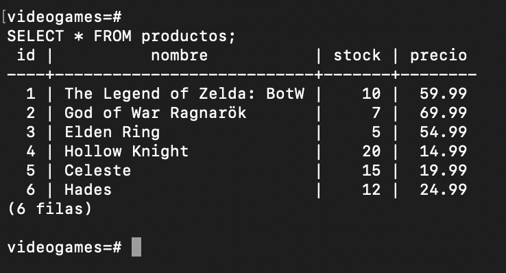
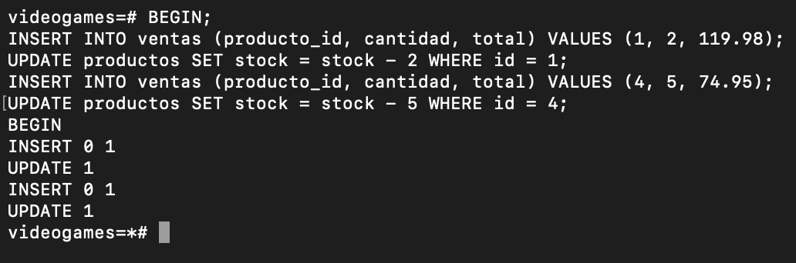
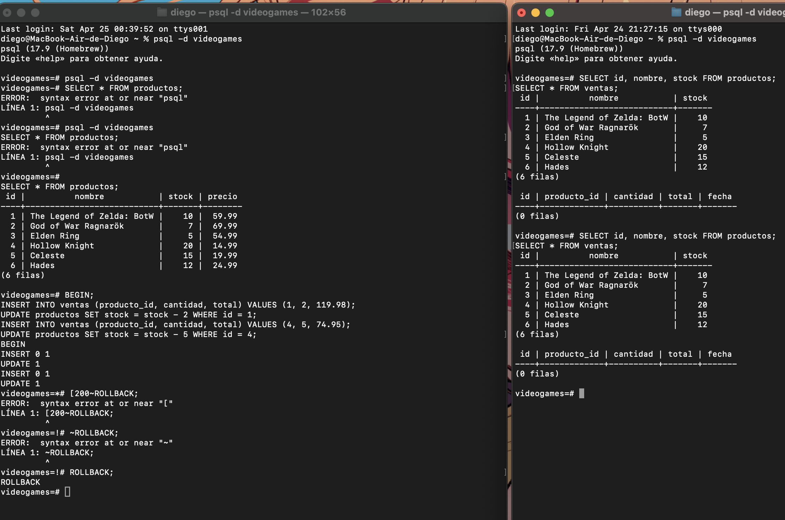
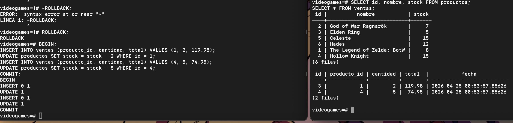
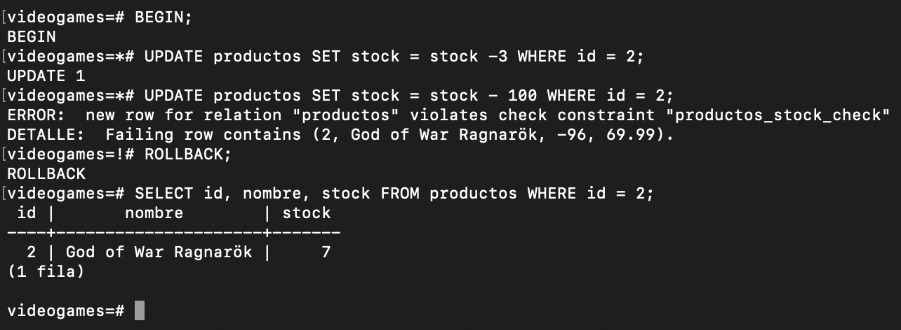
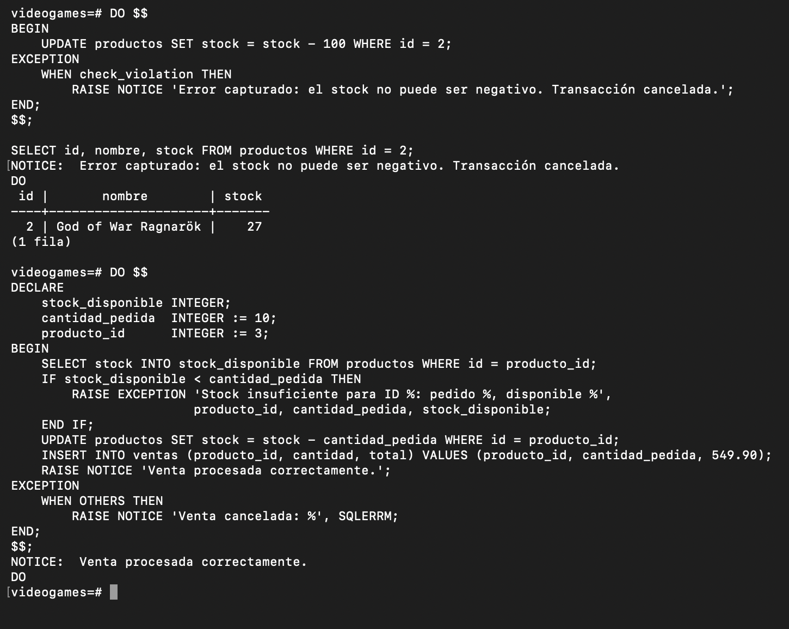
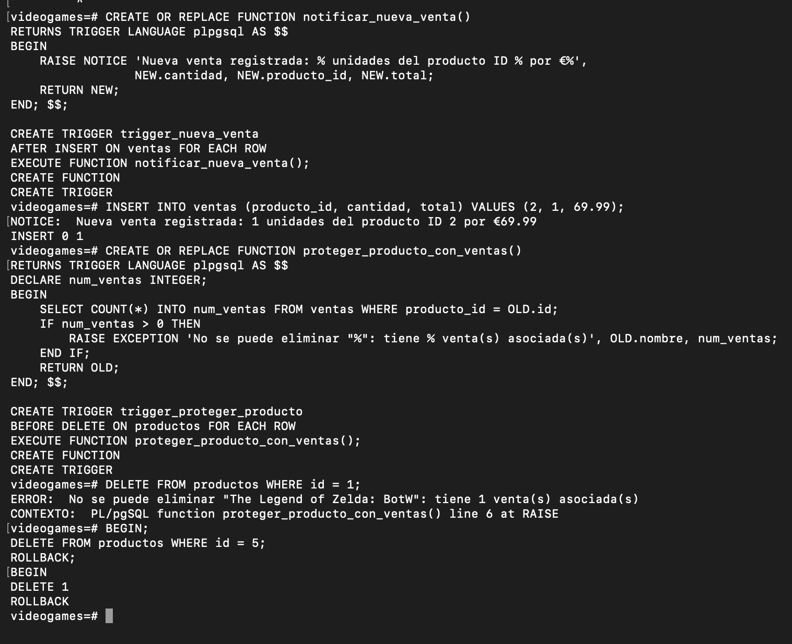

# Transacciones en PostgreSQL
## Atomicidad, BEGIN, COMMIT y ROLLBACK

---

## 1. ¿Qué es una transacción?

Una **transacción** es un conjunto de operaciones SQL que se ejecutan como una **unidad indivisible**. Esto significa que, o bien todas las operaciones tienen éxito y se aplican a la base de datos, o bien ninguna de ellas se aplica. No existe un estado intermedio.

### La analogía del cajero automático

Imagina que transfieres 500 € de tu cuenta A a la cuenta B. Eso implica dos operaciones:

1. **Restar** 500 € de la cuenta A
2. **Sumar** 500 € a la cuenta B

¿Qué pasaría si el sistema falla entre la operación 1 y la operación 2? Sin transacciones, la cuenta A perdería 500 € y la cuenta B no recibiría nada. **El dinero desaparece.** Con transacciones, si algo falla, todo vuelve al estado anterior como si nada hubiera ocurrido.

---

## 2. Propiedades ACID

PostgreSQL garantiza las propiedades **ACID** en todas las transacciones:

| Propiedad | Nombre completo | Significado |
|-----------|-----------------|-------------|
| **A** | Atomicity (Atomicidad) | Todo o nada. Si falla una operación, se deshacen todas. |
| **C** | Consistency (Consistencia) | La base de datos pasa de un estado válido a otro estado válido. |
| **I** | Isolation (Aislamiento) | Las transacciones en paralelo no se interfieren entre sí. |
| **D** | Durability (Durabilidad) | Una vez confirmada (COMMIT), la transacción persiste aunque el sistema falle. |

---

## 3. Los comandos de control de transacción

```sql
BEGIN;       -- Inicia la transacción
COMMIT;      -- Confirma todos los cambios (los guarda definitivamente)
ROLLBACK;    -- Cancela todos los cambios (vuelve al estado anterior)
```

### Diagrama de flujo de una transacción

```
BEGIN
  │
  ├── Operación 1 (INSERT / UPDATE / DELETE)
  ├── Operación 2
  ├── Operación 3
  │
  ├── ¿Todo correcto? ──── SÍ ──→ COMMIT  (cambios guardados)
  │
  └── ¿Algo falló?   ──── SÍ ──→ ROLLBACK (cambios descartados)
```

---

## 4. El peligro de no usar transacciones

### Preparación: creamos la base de datos de ejemplo

Para este ejercicio usamos una tienda de videojuegos con un inventario sencillo.

```sql
CREATE TABLE productos (
    id        SERIAL PRIMARY KEY,
    nombre    VARCHAR(100) NOT NULL,
    stock     INTEGER NOT NULL CHECK (stock >= 0),
    precio    NUMERIC(8,2) NOT NULL
);

CREATE TABLE ventas (
    id           SERIAL PRIMARY KEY,
    producto_id  INTEGER REFERENCES productos(id),
    cantidad     INTEGER NOT NULL,
    total        NUMERIC(8,2) NOT NULL,
    fecha        TIMESTAMP DEFAULT NOW()
);

INSERT INTO productos (nombre, stock, precio) VALUES
    ('The Legend of Zelda: BotW', 10, 59.99),
    ('God of War Ragnarök',        7, 69.99),
    ('Elden Ring',                  5, 54.99),
    ('Hollow Knight',              20, 14.99),
    ('Celeste',                    15, 19.99),
    ('Hades',                      12, 24.99);
```

**Salida esperada en psql:**

```
videogames=# CREATE TABLE productos (...);
CREATE TABLE
videogames=# CREATE TABLE ventas (...);
CREATE TABLE
videogames=# INSERT INTO productos (nombre, stock, precio) VALUES ...;
INSERT 0 6
```

---



---

## 5. Escenario sin transacción — el problema real

Supongamos que un cliente compra 3 unidades de "Elden Ring". Sin transacción, ejecutamos dos sentencias independientes:

```sql
-- Paso 1: registramos la venta
INSERT INTO ventas (producto_id, cantidad, total)
VALUES (3, 3, 164.97);

-- Paso 2: actualizamos el stock
-- *** EN ESTE MOMENTO, OTRO PROCESO MODIFICA EL STOCK ***
UPDATE productos SET stock = stock - 3 WHERE id = 3;
```

Si entre el `INSERT` y el `UPDATE` otro proceso también vende 4 unidades de Elden Ring (que tiene 5 de stock), el resultado puede ser un stock negativo o inconsistente. La base de datos ha quedado en un **estado inválido**.

---

## 6. Solución: usando BEGIN ... COMMIT

```sql
BEGIN;

INSERT INTO ventas (producto_id, cantidad, total)
VALUES (3, 3, 164.97);

UPDATE productos SET stock = stock - 3 WHERE id = 3;

COMMIT;
```

Ahora ambas operaciones son atómicas. El aislamiento de PostgreSQL evita que otro proceso interfiera durante la transacción.

---

## 7. Demostración en dos terminales: el efecto del ROLLBACK

Esta es la parte más importante. Vamos a abrir **dos sesiones de psql simultáneamente** para ver cómo funciona el aislamiento y el ROLLBACK.

### Estado inicial de la tabla

```
videogames=# SELECT * FROM productos;
```

```
 id |           nombre            | stock | precio
----+-----------------------------+-------+--------
  1 | The Legend of Zelda: BotW  |    10 |  59.99
  2 | God of War Ragnarök         |     7 |  69.99
  3 | Elden Ring                  |     5 |  54.99
  4 | Hollow Knight               |    20 |  14.99
  5 | Celeste                     |    15 |  19.99
  6 | Hades                       |    12 |  24.99
(6 rows)
```

---

### PASO 1 — Terminal A inicia una transacción e inserta datos

**[TERMINAL A]**
```sql
videogames=# BEGIN;
BEGIN
videogames=*# INSERT INTO ventas (producto_id, cantidad, total)
videogames-*# VALUES (1, 2, 119.98);
INSERT 0 1
videogames=*# UPDATE productos SET stock = stock - 2 WHERE id = 1;
UPDATE 1
videogames=*# INSERT INTO ventas (producto_id, cantidad, total)
videogames-*# VALUES (4, 5, 74.95);
INSERT 0 1
videogames=*# UPDATE productos SET stock = stock - 5 WHERE id = 4;
UPDATE 1
```

> **Nota:** El símbolo `=*#` en el prompt de psql indica que estamos dentro de una transacción activa. Esos cambios **existen temporalmente** pero aún NO están confirmados.

---



---

### PASO 2 — Terminal B consulta la tabla (¡no ve los cambios!)

**[TERMINAL B]** — Al mismo tiempo, otra persona consulta la base de datos:
```sql
videogames=# SELECT id, nombre, stock FROM productos;
```

```
 id |           nombre            | stock
----+-----------------------------+-------
  1 | The Legend of Zelda: BotW  |    10
  2 | God of War Ragnarök         |     7
  3 | Elden Ring                  |     5
  4 | Hollow Knight               |    20
  5 | Celeste                     |    15
  6 | Hades                       |    12
(6 rows)
```

```sql
videogames=# SELECT * FROM ventas;
```

```
(0 rows)
```

> **Conclusión clave:** Terminal B ve el estado original. Los cambios de Terminal A son **invisibles** para el exterior mientras la transacción no haga COMMIT. Esto es el **aislamiento (Isolation)** de ACID. Así se evita que alguien lea datos a medio guardar.

---


---

### PASO 3 — Terminal A simula un error y ejecuta ROLLBACK

Imaginemos que al intentar procesar el pago del cliente, el sistema de cobros devuelve un error. El operador (o la aplicación) decide cancelar toda la operación:

**[TERMINAL A]**
```sql
videogames=*# -- Simulamos que algo falla (ej: el pago fue rechazado)
videogames=*# ROLLBACK;
ROLLBACK
```

---

### PASO 4 — Terminal B vuelve a consultar: los datos están intactos

**[TERMINAL B]**
```sql
videogames=# SELECT id, nombre, stock FROM productos;
```

```
 id |           nombre            | stock
----+-----------------------------+-------
  1 | The Legend of Zelda: BotW  |    10
  2 | God of War Ragnarök         |     7
  3 | Elden Ring                  |     5
  4 | Hollow Knight               |    20
  5 | Celeste                     |    15
  6 | Hades                       |    12
(6 rows)
```

```sql
videogames=# SELECT * FROM ventas;
```

```
(0 rows)
```

> **Conclusión:** Todos los cambios realizados en Terminal A (los dos INSERT en ventas y los dos UPDATE en stock) han sido **completamente eliminados**. La base de datos volvió exactamente al estado anterior al `BEGIN`. Es como si esas operaciones nunca hubieran existido.

---



---

### PASO 5 — Ahora hacemos la transacción correctamente con COMMIT

**[TERMINAL A]** — Esta vez todo sale bien:
```sql
videogames=# BEGIN;
BEGIN
videogames=*# INSERT INTO ventas (producto_id, cantidad, total)
videogames-*# VALUES (1, 2, 119.98);
INSERT 0 1
videogames=*# UPDATE productos SET stock = stock - 2 WHERE id = 1;
UPDATE 1
videogames=*# INSERT INTO ventas (producto_id, cantidad, total)
videogames-*# VALUES (4, 5, 74.95);
INSERT 0 1
videogames=*# UPDATE productos SET stock = stock - 5 WHERE id = 4;
UPDATE 1
videogames=*# COMMIT;
COMMIT
```

**[TERMINAL B]** — Ahora sí se ven los cambios:
```sql
videogames=# SELECT id, nombre, stock FROM productos;
```

```
 id |           nombre            | stock
----+-----------------------------+-------
  1 | The Legend of Zelda: BotW  |     8
  2 | God of War Ragnarök         |     7
  3 | Elden Ring                  |     5
  4 | Hollow Knight               |    15
  5 | Celeste                     |    15
  6 | Hades                       |    12
(6 rows)
```

```sql
videogames=# SELECT * FROM ventas;
```

```
 id | producto_id | cantidad |  total  |            fecha
----+-------------+----------+---------+----------------------------
  3 |           1 |        2 |  119.98 | 2026-04-25 00:53:57.85626
  4 |           4 |        5 |   74.95 | 2026-04-25 00:53:57.85626
(2 rows)
```

> **Conclusión final:** Tras el `COMMIT`, los cambios son permanentes y visibles para todas las sesiones. El stock de Zelda bajó de 10 a 8, y el de Hollow Knight de 20 a 15, coherentemente con las ventas registradas.

---



---

## 8. ROLLBACK automático por error de restricción

PostgreSQL también hace ROLLBACK automáticamente cuando una operación viola una restricción de la base de datos.

```sql
videogames=# BEGIN;
BEGIN
videogames=*# UPDATE productos SET stock = stock - 3 WHERE id = 2;
UPDATE 1
videogames=*# -- Intentamos dejar el stock en negativo (viola CHECK stock >= 0)
videogames=*# UPDATE productos SET stock = stock - 100 WHERE id = 2;
ERROR:  new row for relation "productos" violates check constraint "productos_stock_check"
DETAIL:  Failing row contains (2, God of War Ragnarök, -96, 69.99).
videogames=!# -- El símbolo =!# indica que la transacción está en estado de error
videogames=!# ROLLBACK;
ROLLBACK
```

```sql
videogames=# SELECT id, nombre, stock FROM productos WHERE id = 2;
```

```
 id |       nombre        | stock
----+---------------------+-------
  2 | God of War Ragnarök |     7
(1 row)
```

> El stock volvió a 7, como si nada hubiera ocurrido. El símbolo `=!#` es la forma que tiene psql de avisarnos que la transacción está en un estado de error y **solo acepta ROLLBACK**.

---



---

## 9. Manejo de errores con EXCEPTION

Dentro de un bloque PL/pgSQL podemos capturar errores con `EXCEPTION` y decidir qué hacer: registrar el problema, lanzar un mensaje alternativo o simplemente ignorarlo. Esto permite construir operaciones robustas que nunca dejan la base de datos en un estado inconsistente.

### 9.1 Capturar un error de restricción

```sql
-- Intentamos reducir el stock de God of War por debajo de cero
DO $$
BEGIN
    UPDATE productos SET stock = stock - 100 WHERE id = 2;
EXCEPTION
    WHEN check_violation THEN
        RAISE NOTICE 'Error capturado: el stock no puede ser negativo. Transacción cancelada.';
END;
$$;
```

**Salida:**
```
NOTICE:  Error capturado: el stock no puede ser negativo. Transacción cancelada.
DO
```

```sql
-- Verificamos que el stock NO cambió
SELECT id, nombre, stock FROM productos WHERE id = 2;
```

```
 id |       nombre        | stock
----+---------------------+-------
  2 | God of War Ragnarök |    27
(1 row)
```

> El bloque `EXCEPTION WHEN check_violation` capturó el error antes de que afectara a la base de datos. El `UPDATE` fue revertido automáticamente dentro del bloque. A diferencia del ROLLBACK manual (sección 8), aquí el manejo es interno: no hace falta intervenir desde fuera.

### 9.2 WHEN OTHERS — captura genérica de cualquier error

El manejo de errores más flexible es `WHEN OTHERS`, equivalente al `except Exception` de Python. Permite construir operaciones que nunca se interrumpen abruptamente:

```sql
DO $$
DECLARE
    stock_disponible INTEGER;
    cantidad_pedida  INTEGER := 10;   -- Dentro del stock disponible tras la reposición
    producto_id      INTEGER := 3;    -- Elden Ring (stock actual: 13, repuesto anteriormente)
BEGIN
    SELECT stock INTO stock_disponible
    FROM productos WHERE id = producto_id;

    IF stock_disponible < cantidad_pedida THEN
        RAISE EXCEPTION 'Stock insuficiente para ID %: pedido %, disponible %',
                        producto_id, cantidad_pedida, stock_disponible;
    END IF;

    UPDATE productos SET stock = stock - cantidad_pedida WHERE id = producto_id;
    INSERT INTO ventas (producto_id, cantidad, total)
    VALUES (producto_id, cantidad_pedida, 549.90);

    RAISE NOTICE 'Venta procesada correctamente.';

EXCEPTION
    WHEN OTHERS THEN
        RAISE NOTICE 'Venta cancelada: %', SQLERRM;
END;
$$;
```

**Salida:**
```
NOTICE:  Venta procesada correctamente.
DO
```

> En este punto de la sesión, Elden Ring dispone de 13 unidades (fue repuesto con `CALL reponer_stock(3, 10)` en la sección de procedimientos), por lo que el pedido de 10 unidades se completa sin errores y la rama `EXCEPTION` no llega a ejecutarse. Esto demuestra el camino feliz del bloque: cuando todas las operaciones tienen éxito, el control nunca pasa al manejador `WHEN OTHERS`. `SQLERRM` solo tendría contenido si se hubiera lanzado una excepción, y en ese caso contendría el texto exacto del error para mostrarlo o registrarlo.

---



---

## 10. Triggers — Automatización e integridad

Un **trigger** se ejecuta automáticamente cuando ocurre un evento (INSERT, UPDATE, DELETE) en una tabla. En el contexto de transacciones, los triggers son la última línea de defensa: garantizan que ciertas reglas se cumplan sin importar desde dónde llegue la operación.

| Tipo | Cuándo actúa | Uso típico |
|------|-------------|------------|
| `AFTER INSERT` | Tras insertar una fila | Notificaciones, auditoría |
| `BEFORE DELETE` | Antes de borrar una fila | Proteger integridad referencial |

### 10.1 Trigger AFTER INSERT — notificación automática de nuevas ventas

```sql
CREATE OR REPLACE FUNCTION notificar_nueva_venta()
RETURNS TRIGGER
LANGUAGE plpgsql
AS $$
BEGIN
    RAISE NOTICE 'Nueva venta registrada: % unidades del producto ID % por €%',
                 NEW.cantidad, NEW.producto_id, NEW.total;
    RETURN NEW;
END;
$$;

CREATE TRIGGER trigger_nueva_venta
AFTER INSERT ON ventas
FOR EACH ROW
EXECUTE FUNCTION notificar_nueva_venta();
```

**Prueba:**
```sql
INSERT INTO ventas (producto_id, cantidad, total) VALUES (2, 1, 69.99);
```

```
NOTICE:  Nueva venta registrada: 1 unidades del producto ID 2 por €69.99
INSERT 0 1
```

> El trigger se disparó automáticamente tras el INSERT, sin que ningún código externo lo invocara. Esto es útil para registrar actividad, actualizar contadores o enviar alertas de forma transparente para la aplicación.

### 10.2 Trigger BEFORE DELETE — proteger productos con historial de ventas

```sql
CREATE OR REPLACE FUNCTION proteger_producto_con_ventas()
RETURNS TRIGGER
LANGUAGE plpgsql
AS $$
DECLARE
    num_ventas INTEGER;
BEGIN
    SELECT COUNT(*) INTO num_ventas FROM ventas WHERE producto_id = OLD.id;

    IF num_ventas > 0 THEN
        RAISE EXCEPTION 'No se puede eliminar "%": tiene % venta(s) asociada(s)',
                        OLD.nombre, num_ventas;
    END IF;

    RETURN OLD;
END;
$$;

CREATE TRIGGER trigger_proteger_producto
BEFORE DELETE ON productos
FOR EACH ROW
EXECUTE FUNCTION proteger_producto_con_ventas();
```

**Caso 1 — Producto con ventas (debe fallar):**
```sql
DELETE FROM productos WHERE id = 1;
```

```
ERROR:  No se puede eliminar "The Legend of Zelda: BotW": tiene 1 venta(s) asociada(s)
```

**Caso 2 — Producto sin ventas (el trigger lo permite; usamos ROLLBACK para conservar los datos):**
```sql
BEGIN;
DELETE FROM productos WHERE id = 5;
ROLLBACK;
```

```
BEGIN
DELETE 1
ROLLBACK
```

> En el caso 1, el trigger bloqueó el DELETE con `RAISE EXCEPTION` antes de que llegara a ejecutarse. En el caso 2, `RETURN OLD` permite la operación porque el producto no tiene ventas; usamos `ROLLBACK` para no perder el dato de prueba.

---



---

## 11. SAVEPOINT — Puntos de guardado intermedios

PostgreSQL permite crear puntos de recuperación dentro de una transacción. Si algo falla, podemos volver a un punto intermedio sin deshacer todo.

```sql
BEGIN;

INSERT INTO ventas (producto_id, cantidad, total) VALUES (5, 1, 19.99);
UPDATE productos SET stock = stock - 1 WHERE id = 5;

SAVEPOINT venta_celeste_ok;  -- Guardamos un punto seguro

INSERT INTO ventas (producto_id, cantidad, total) VALUES (6, 3, 74.97);
UPDATE productos SET stock = stock - 3 WHERE id = 6;

-- Simulamos que esta segunda venta falla
ROLLBACK TO SAVEPOINT venta_celeste_ok;

-- Solo la primera venta persiste
COMMIT;
```

```
BEGIN
INSERT 0 1
UPDATE 1
SAVEPOINT
INSERT 0 1
UPDATE 1
ROLLBACK
COMMIT
```

---

## 12. Resumen visual

```
┌─────────────────────────────────────────────────────────────────┐
│                     CICLO DE VIDA DE UNA TRANSACCIÓN            │
├─────────────────────────────────────────────────────────────────┤
│                                                                  │
│   BEGIN                                                          │
│     │                                                            │
│     ▼                                                            │
│   [Operaciones SQL]  ←──── otras sesiones NO ven estos cambios  │
│     │                                                            │
│     ├── Error o decisión de cancelar ──→ ROLLBACK               │
│     │                                         │                  │
│     │                                         ▼                  │
│     │                               Base de datos intacta        │
│     │                                                            │
│     └── Todo correcto ──→ COMMIT                                │
│                                  │                               │
│                                  ▼                               │
│                        Cambios permanentes y visibles            │
└─────────────────────────────────────────────────────────────────┘
```

---

## 13. Conclusiones

1. **Sin transacciones**, cualquier fallo entre dos operaciones relacionadas deja la base de datos en un estado inconsistente e inválido.

2. **`BEGIN`** inicia una zona segura donde todas las operaciones son provisionales.

3. **`COMMIT`** es el punto de no retorno: los cambios son permanentes y visibles para todos.

4. **`ROLLBACK`** es el "deshacer" total: la base de datos vuelve exactamente al estado anterior al `BEGIN`.

5. El **aislamiento** garantiza que otras sesiones no vean los datos a medio modificar, evitando lecturas sucias.

6. **`SAVEPOINT`** permite recuperación parcial dentro de una transacción larga.

7. PostgreSQL hace **ROLLBACK automático** cuando detecta una violación de restricción dentro de una transacción.
