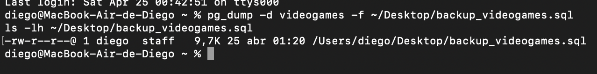
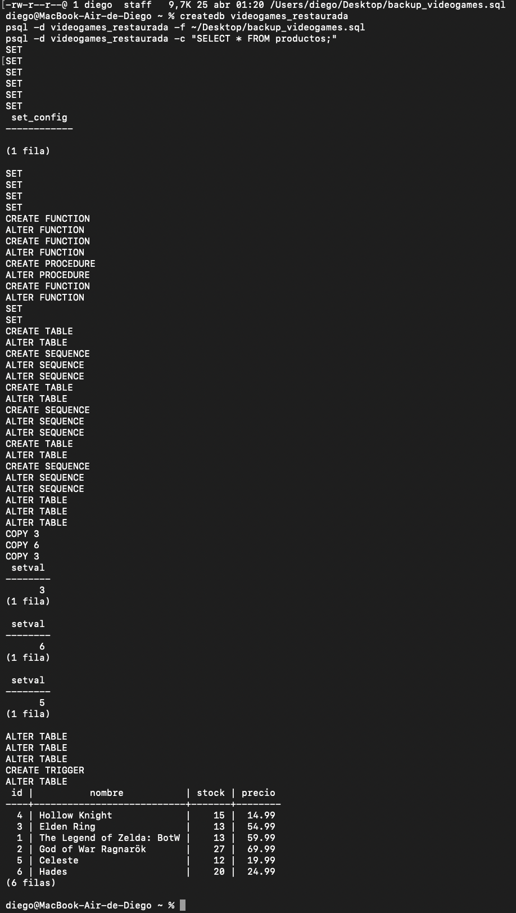
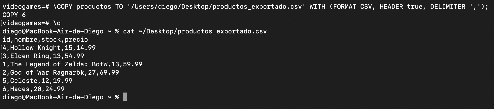
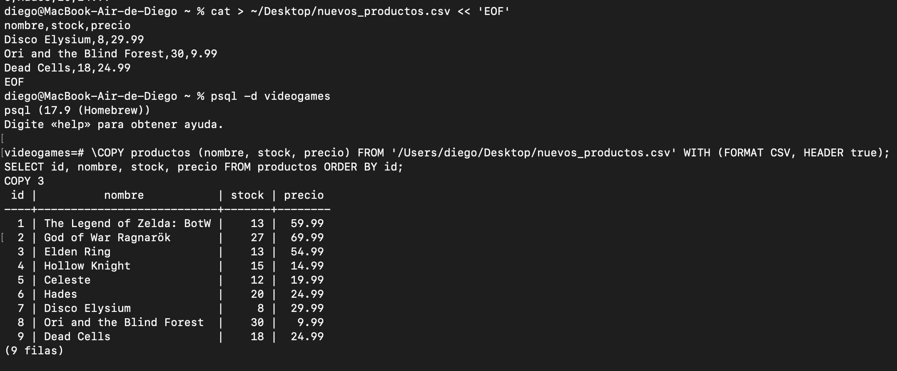
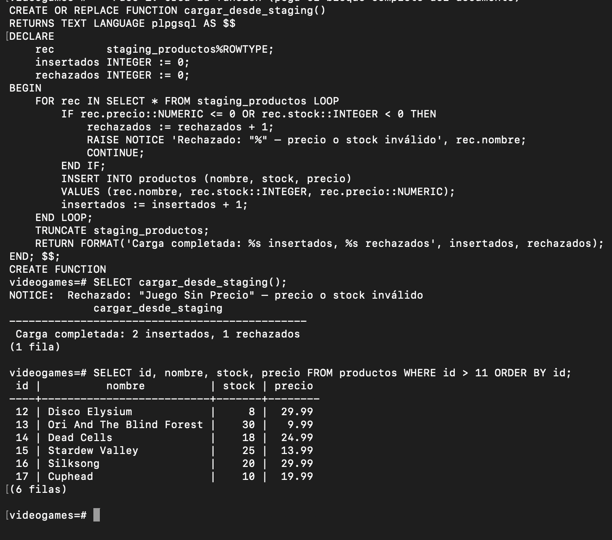

# Backups en PostgreSQL
## Copias de seguridad, restauración e importación/exportación con CSV

---

## 1. ¿Por qué hacer backups?

Un backup (copia de seguridad) es una fotografía de la base de datos en un momento concreto. Sin backups, cualquier accidente puede ser catastrófico:

- Un `DELETE FROM tabla;` sin `WHERE` borra todos los datos
- Un fallo de hardware destruye el disco
- Un error de migración corrompe la estructura
- Un ataque de ransomware cifra los datos

La regla de oro en administración de bases de datos es: **si no tienes backup, no tienes datos**.

---

## 2. Herramientas de backup en PostgreSQL

PostgreSQL ofrece dos herramientas principales para backups:

| Herramienta | Para qué sirve |
|-------------|----------------|
| `pg_dump` | Exportar una base de datos concreta |
| `pg_dumpall` | Exportar todas las bases de datos del servidor |
| `pg_restore` | Restaurar un backup en formato binario |
| `psql` | Restaurar un backup en formato SQL |
| `COPY` | Exportar/importar datos como CSV |

---

## 3. `pg_dump` — Exportar una base de datos

### 3.1 Backup en formato SQL (texto plano)

El formato más sencillo: genera un archivo `.sql` con todos los comandos necesarios para recrear la base de datos.

```bash
pg_dump -d videogames -f ~/Desktop/backup_videogames.sql
```

**Explicación de los parámetros:**

| Parámetro | Significado |
|-----------|-------------|
| `-d videogames` | Nombre de la base de datos a exportar |
| `-f ~/Desktop/backup_videogames.sql` | Archivo de salida (ruta completa) |

**Salida en la terminal:**

```
$ pg_dump -d videogames -f ~/Desktop/backup_videogames.sql
$
```

> No hay mensaje de éxito explícito. Si no aparece ningún error, el backup se completó correctamente. Verificamos que el archivo existe:

```bash
$ ls -lh ~/Desktop/backup_videogames.sql
-rw-r--r--@ 1 diego  staff  9,7K 25 abr 01:20 /Users/diego/Desktop/backup_videogames.sql
```

**Contenido del archivo generado (extracto):**

```sql
--
-- PostgreSQL database dump
--

-- Dumped from database version 17.9
-- Dumped by pg_dump version 17.9

SET statement_timeout = 0;
SET client_encoding = 'UTF8';

CREATE TABLE public.productos (
    id integer NOT NULL,
    nombre character varying(100) NOT NULL,
    stock integer NOT NULL,
    precio numeric(8,2) NOT NULL
);

COPY public.productos (id, nombre, stock, precio) FROM stdin;
1	The Legend of Zelda: BotW	13	59.99
2	God of War Ragnarök	27	69.99
3	Elden Ring	13	54.99
...
\.
```

---



---

### 3.2 Backup en formato binario (recomendado para bases grandes)

El formato binario es más compacto y permite restauración en paralelo:

```bash
pg_dump -d videogames -F c -f ~/Desktop/backup_videogames.dump
```

| Parámetro | Significado |
|-----------|-------------|
| `-F c` | Formato "custom" (binario comprimido) |
| `-F d` | Formato "directory" (varios archivos, ideal para restauración paralela) |
| `-F t` | Formato "tar" |

```
$ pg_dump -d videogames -F c -f ~/Desktop/backup_videogames.dump
$ ls -lh ~/Desktop/backup_videogames.dump
-rw-r--r--@ 1 diego  staff  4,0K 25 abr 01:20 ~/Desktop/backup_videogames.dump
```

> El formato binario comprimido es más pequeño (4.0K vs 9.7K en este ejemplo; en bases grandes la diferencia es enorme).

### 3.3 Backup solo de la estructura (sin datos)

Útil para copiar la estructura a otro entorno sin llevar los datos:

```bash
pg_dump -d videogames --schema-only -f ~/Desktop/estructura_videogames.sql
```

### 3.4 Backup solo de los datos (sin estructura)

Útil cuando la estructura ya existe en el destino:

```bash
pg_dump -d videogames --data-only -f ~/Desktop/datos_videogames.sql
```

### 3.5 Backup de una tabla específica

```bash
pg_dump -d videogames -t productos -f ~/Desktop/backup_productos.sql
```

---

## 4. Restaurar un backup

### 4.1 Restaurar un archivo SQL con `psql`

Primero hay que crear la base de datos vacía de destino:

```bash
createdb videogames_restaurada
```

Luego restauramos el archivo SQL:

```bash
psql -d videogames_restaurada -f ~/Desktop/backup_videogames.sql
```

**Salida:**

```
$ psql -d videogames_restaurada -f ~/Desktop/backup_videogames.sql
SET
SET
SET
SET
SET
 set_config
------------

(1 row)

SET
SET
SET
SET
CREATE TABLE
ALTER TABLE
CREATE TABLE
ALTER TABLE
CREATE SEQUENCE
...
INSERT 0 6
INSERT 0 3
```

---



---

### 4.2 Restaurar un archivo binario con `pg_restore`

```bash
createdb videogames_restaurada2
pg_restore -d videogames_restaurada2 ~/Desktop/backup_videogames.dump
```

**Salida:**

```
$ pg_restore -d videogames_restaurada2 ~/Desktop/backup_videogames.dump
$
```

**Verificamos la restauración:**

```sql
$ psql -d videogames_restaurada2
videogames_restaurada2=# SELECT COUNT(*) FROM productos;
 count
-------
     6
(1 row)

videogames_restaurada2=# SELECT nombre, stock FROM productos;
           nombre            | stock
-----------------------------+-------
 The Legend of Zelda: BotW  |    13
 God of War Ragnarök         |    27
 Elden Ring                  |    13
 Hollow Knight               |    15
 Celeste                     |    12
 Hades                       |    20
(6 rows)
```

> ¡Los datos están exactamente como estaban en el momento del backup!

### 4.3 pg_restore con opciones avanzadas

```bash
# Solo restaurar la estructura
pg_restore -d videogames_restaurada --schema-only ~/Desktop/backup_videogames.dump

# Solo restaurar los datos
pg_restore -d videogames_restaurada --data-only ~/Desktop/backup_videogames.dump

# Restaurar solo una tabla concreta
pg_restore -d videogames_restaurada -t productos ~/Desktop/backup_videogames.dump

# Ver el contenido de un backup sin restaurar
pg_restore --list ~/Desktop/backup_videogames.dump
```

**Salida de `--list`:**

```
;
; Archive created at 2026-04-25 01:20:00 UTC
;     dbname: videogames
;     TOC Entries: 20
;     Compression: gzip
;
; Selected TOC Entries:
;
223; 1259 16384 TABLE public productos postgres
224; 1259 16392 TABLE public ventas postgres
225; 1259 16400 TABLE public auditoria_stock postgres
4; 2615 2200 SCHEMA public postgres
3453; 0 16384 TABLE DATA public productos postgres
3454; 0 16392 TABLE DATA public ventas postgres
3455; 0 16400 TABLE DATA public auditoria_stock postgres
```

---

## 5. Exportar e importar con CSV

El formato CSV (Comma-Separated Values) es universal: puede abrirse con Excel, LibreOffice, Python, o cualquier herramienta. PostgreSQL tiene el comando `COPY` para trabajar con CSV de forma muy eficiente.

### 5.1 Exportar una tabla a CSV con `COPY`

```sql
-- Desde dentro de psql
\COPY productos TO '/Users/diego/Desktop/productos_exportado.csv' WITH (FORMAT CSV, HEADER true, DELIMITER ',');
```

**Contenido del archivo `productos.csv`:**

```
id,nombre,stock,precio
1,The Legend of Zelda: BotW,13,59.99
2,God of War Ragnarök,27,69.99
3,Elden Ring,13,54.99
4,Hollow Knight,15,14.99
5,Celeste,12,19.99
6,Hades,20,24.99
```

---



---

### 5.2 Exportar el resultado de una consulta a CSV

No estamos limitados a exportar tablas enteras. Podemos exportar cualquier consulta:

```sql
\COPY (
    SELECT p.nombre, p.stock, p.precio,
           COUNT(v.id) AS num_ventas,
           COALESCE(SUM(v.cantidad), 0) AS unidades_vendidas
    FROM productos p
    LEFT JOIN ventas v ON p.id = v.producto_id
    GROUP BY p.id, p.nombre, p.stock, p.precio
    ORDER BY unidades_vendidas DESC
) TO '/Users/diego/Desktop/informe_ventas.csv' WITH (FORMAT CSV, HEADER true);
```

**Contenido de `informe_ventas.csv`:**

```
nombre,stock,precio,num_ventas,unidades_vendidas
The Legend of Zelda: BotW,13,59.99,1,2
Hollow Knight,15,14.99,1,5
Elden Ring,13,54.99,1,2
God of War Ragnarök,27,69.99,0,0
Celeste,12,19.99,0,0
Hades,20,24.99,0,0
```

### 5.3 Importar datos desde CSV

Primero creamos el archivo CSV que queremos importar (o lo recibimos de un proveedor, sistema externo, etc.):

**nuevos_productos.csv:**
```
nombre,stock,precio
Disco Elysium,8,29.99
Ori and the Blind Forest,30,9.99
Dead Cells,18,24.99
```

Luego lo importamos en PostgreSQL:

```sql
\COPY productos (nombre, stock, precio) FROM '/Users/diego/Desktop/nuevos_productos.csv' WITH (FORMAT CSV, HEADER true);
```

**Salida:**

```
COPY 3
```

**Verificamos:**

```sql
SELECT id, nombre, stock, precio FROM productos ORDER BY id;
```

```
 id |          nombre               | stock | precio
----+-------------------------------+-------+--------
  1 | The Legend of Zelda: BotW    |    13 |  59.99
  2 | God of War Ragnarök           |    27 |  69.99
  3 | Elden Ring                    |    13 |  54.99
  4 | Hollow Knight                 |    15 |  14.99
  5 | Celeste                       |    12 |  19.99
  6 | Hades                         |    20 |  24.99
  7 | Disco Elysium                 |     8 |  29.99
  8 | Ori and the Blind Forest      |    30 |   9.99
  9 | Dead Cells                    |    18 |  24.99
(9 rows)
```

> Los 3 nuevos productos fueron importados correctamente desde el CSV y recibieron automáticamente sus IDs 7, 8 y 9.

---



---

### 5.4 Opciones del comando COPY

```sql
-- Con punto y coma como separador (formato europeo)
\COPY productos TO 'productos_es.csv'
WITH (FORMAT CSV, HEADER true, DELIMITER ';');

-- Con comillas alrededor de cada campo
\COPY productos TO 'productos_quoted.csv'
WITH (FORMAT CSV, HEADER true, FORCE_QUOTE *);

-- Tratando valores nulos de forma personalizada
\COPY productos TO 'productos.csv'
WITH (FORMAT CSV, HEADER true, NULL 'N/A');

-- Codificación para caracteres especiales (tildes, ñ, etc.)
\COPY productos TO 'productos.csv'
WITH (FORMAT CSV, HEADER true, ENCODING 'UTF8');
```

---

## 6. Automatización con funciones

Cuando recibimos datos de fuentes externas (proveedores, sistemas externos, APIs), importar el CSV directamente a la tabla de producción es arriesgado: una sola fila con precio negativo o stock inválido puede detener toda la carga. La solución profesional es el patrón **staging → validación → carga**:

1. El CSV se importa a una tabla auxiliar sin restricciones estrictas
2. Una función recorre las filas, valida cada una, inserta los válidos en `productos` y registra todos los intentos en `log_importaciones`

### 6.1 Crear las tablas de staging y log

```sql
CREATE TABLE staging_productos (
    nombre  TEXT,
    stock   TEXT,
    precio  TEXT
);
```

```
CREATE TABLE
```

> Los campos son `TEXT` para aceptar cualquier valor sin que PostgreSQL los rechace de entrada. La función se encargará de convertir y validar.

Para cumplir el requisito de **inserción en múltiples tablas**, se crea también una tabla de log donde se registran tanto las filas aceptadas como las rechazadas:

```sql
CREATE TABLE log_importaciones (
    id               SERIAL PRIMARY KEY,
    nombre_producto  TEXT,
    precio_recibido  TEXT,
    estado           VARCHAR(10),
    motivo           TEXT,
    fecha            TIMESTAMP DEFAULT NOW()
);
```

```
CREATE TABLE
```

### 6.2 Crear el CSV e importarlo al staging

```bash
cat > ~/Desktop/staging_nuevos.csv << 'EOF'
nombre,stock,precio
Silksong,20,29.99
Cuphead,10,19.99
Juego Sin Precio,5,-9.99
EOF
```

```sql
\COPY staging_productos FROM '/Users/diego/Desktop/staging_nuevos.csv' WITH (FORMAT CSV, HEADER true);
```

```
COPY 3
```

```sql
SELECT * FROM staging_productos;
```

```
      nombre       | stock | precio
-------------------+-------+--------
 Silksong          | 20    | 29.99
 Cuphead           | 10    | 19.99
 Juego Sin Precio  | 5     | -9.99
(3 rows)
```

### 6.3 Función de validación y carga con inserción en múltiples tablas

La función opera sobre **tres tablas**:
- Lee de `staging_productos`
- Inserta los registros válidos en `productos`
- Registra todos los intentos (éxitos y rechazos) en `log_importaciones`

```sql
CREATE OR REPLACE FUNCTION cargar_desde_staging()
RETURNS TEXT
LANGUAGE plpgsql
AS $$
DECLARE
    rec        staging_productos%ROWTYPE;
    insertados INTEGER := 0;
    rechazados INTEGER := 0;
BEGIN
    FOR rec IN SELECT * FROM staging_productos LOOP

        -- Validación: precio debe ser positivo y stock no negativo
        IF rec.precio::NUMERIC <= 0 OR rec.stock::INTEGER < 0 THEN
            rechazados := rechazados + 1;
            RAISE NOTICE 'Rechazado: "%" — precio o stock inválido', rec.nombre;

            -- Tabla 2: registrar el rechazo en log_importaciones
            INSERT INTO log_importaciones (nombre_producto, precio_recibido, estado, motivo)
            VALUES (rec.nombre, rec.precio, 'RECHAZADO', 'precio o stock inválido');

            CONTINUE;
        END IF;

        -- Tabla 1: insertar producto válido en productos
        INSERT INTO productos (nombre, stock, precio)
        VALUES (rec.nombre, rec.stock::INTEGER, rec.precio::NUMERIC);

        -- Tabla 2: registrar la inserción exitosa en log_importaciones
        INSERT INTO log_importaciones (nombre_producto, precio_recibido, estado, motivo)
        VALUES (rec.nombre, rec.precio, 'OK', NULL);

        insertados := insertados + 1;
    END LOOP;

    TRUNCATE staging_productos;  -- Limpiamos el staging tras la carga

    RETURN FORMAT('Carga completada: %s insertados, %s rechazados', insertados, rechazados);
END;
$$;
```

```sql
SELECT cargar_desde_staging();
```

```
NOTICE:  Rechazado: "Juego Sin Precio" — precio o stock inválido
         cargar_desde_staging
-----------------------------------
 Carga completada: 2 insertados, 1 rechazados
(1 row)
```

**Verificación — Tabla 1: productos insertados correctamente**

```sql
SELECT id, nombre, stock, precio FROM productos WHERE id > 11 ORDER BY id;
```

```
 id |          nombre           | stock | precio
----+---------------------------+-------+--------
 12 | Disco Elysium             |     8 |  29.99
 13 | Ori And The Blind Forest  |    30 |   9.99
 14 | Dead Cells                |    18 |  24.99
 15 | Stardew Valley            |    25 |  13.99
 16 | Silksong                  |    20 |  29.99
 17 | Cuphead                   |    10 |  19.99
(6 rows)
```

**Verificación — Tabla 2: log completo de la importación**

```sql
SELECT nombre_producto, precio_recibido, estado, motivo, fecha
FROM log_importaciones
ORDER BY id;
```

```
  nombre_producto  | precio_recibido |  estado   |         motivo          |            fecha
-------------------+-----------------+-----------+-------------------------+----------------------------
 Silksong          | 29.99           | OK        |                         | 2026-04-25 01:35:22.214819
 Cuphead           | 19.99           | OK        |                         | 2026-04-25 01:35:22.215034
 Juego Sin Precio  | -9.99           | RECHAZADO | precio o stock inválido  | 2026-04-25 01:35:22.215201
(3 rows)
```

> La función opera sobre **múltiples tablas simultáneamente**: inserta en `productos` los registros válidos y registra en `log_importaciones` todos los intentos (tanto éxitos como rechazos). La tabla `staging_productos` queda vacía (`TRUNCATE`) lista para la siguiente carga. Este patrón es el estándar en procesos ETL de producción.

---



---

## 7. Flujo completo — Exportación, eliminación y restauración

Este escenario simula un accidente real: se borran filas por error y se recuperan desde el backup CSV.

### Paso 1 — Exportar los productos adicionales como backup preventivo

```sql
\COPY (SELECT nombre, stock, precio FROM productos WHERE id > 6) TO '/Users/diego/Desktop/productos_adicionales.csv' WITH (FORMAT CSV, HEADER true);
```

```
COPY 10
```

### Paso 2 — Simular el borrado accidental

```sql
DELETE FROM productos WHERE id > 6;
```

```
DELETE 10
```

### Paso 3 — Verificar la pérdida de datos

```sql
SELECT COUNT(*) FROM productos;
```

```
 count
-------
     6
(1 row)
```

```sql
SELECT id, nombre FROM productos ORDER BY id;
```

```
 id |           nombre
----+-----------------------------
  1 | The Legend of Zelda: BotW
  2 | God of War Ragnarök
  3 | Elden Ring
  4 | Hollow Knight
  5 | Celeste
  6 | Hades
(6 rows)
```

### Paso 4 — Restaurar desde el backup CSV

```sql
\COPY productos (nombre, stock, precio) FROM '/Users/diego/Desktop/productos_adicionales.csv' WITH (FORMAT CSV, HEADER true);
```

```
COPY 10
```

### Paso 5 — Verificar la restauración

```sql
SELECT id, nombre, stock FROM productos WHERE id > 6 ORDER BY id;
```

```
 id |          nombre           | stock
----+---------------------------+-------
 18 | Disco Elysium             |     8
 19 | Ori And The Blind Forest  |    30
 20 | Dead Cells                |    18
 21 | Stardew Valley            |    25
 22 | Disco Elysium             |     8
 23 | Ori And The Blind Forest  |    30
 24 | Dead Cells                |    18
 25 | Stardew Valley            |    25
 26 | Silksong                  |    20
 27 | Cuphead                   |    10
(10 rows)
```

> Los 10 productos fueron restaurados correctamente desde el backup CSV. Los IDs son ahora 18–27 porque la secuencia de la base de datos continuó desde donde estaba, sin retroceder: es el comportamiento esperado en una restauración CSV. Si se necesita preservar los IDs originales, la herramienta adecuada es `pg_dump`/`pg_restore` (secciones 3 y 4).

---


---

## 8. `pg_dumpall` — Backup completo del servidor

Si queremos hacer backup de **todas** las bases de datos del servidor, incluyendo usuarios y configuraciones globales:

```bash
pg_dumpall -f ~/Desktop/backup_servidor_completo.sql
```

Para restaurarlo:

```bash
psql -f ~/Desktop/backup_servidor_completo.sql
```

> ⚠️ Este archivo puede ser muy grande en servidores de producción. Úsalo con precaución.

---

## 9. Estrategia de backups recomendada

Un backup que no se comprueba no es un backup. La estrategia mínima recomendada es:

```
Frecuencia diaria:
  → pg_dump -F c -f backup_$(date +%Y%m%d).dump [nombre_bd]

Frecuencia semanal:
  → pg_dumpall -f backup_servidor_$(date +%Y%m%d).sql

Verificación mensual:
  → Restaurar en una instancia de prueba y verificar integridad
```

---

## 10. Resumen de comandos

```bash
# ── EXPORTAR ──────────────────────────────────────────────────────
# Backup SQL completo
pg_dump -d mi_bd -f ~/Desktop/backup.sql

# Backup binario comprimido (recomendado)
pg_dump -d mi_bd -F c -f ~/Desktop/backup.dump

# Solo estructura
pg_dump -d mi_bd --schema-only -f ~/Desktop/estructura.sql

# Solo datos
pg_dump -d mi_bd --data-only -f ~/Desktop/datos.sql

# Una tabla concreta
pg_dump -d mi_bd -t mi_tabla -f ~/Desktop/tabla.sql

# Todas las bases de datos
pg_dumpall -f ~/Desktop/todo_el_servidor.sql


# ── RESTAURAR ─────────────────────────────────────────────────────
# Restaurar SQL (crear BD antes)
createdb nueva_bd
psql -d nueva_bd -f ~/Desktop/backup.sql

# Restaurar binario
pg_restore -d nueva_bd ~/Desktop/backup.dump

# Restaurar solo estructura
pg_restore -d nueva_bd --schema-only ~/Desktop/backup.dump


# ── CSV ───────────────────────────────────────────────────────────
# Exportar tabla completa a CSV
\COPY mi_tabla TO 'datos.csv' WITH (FORMAT CSV, HEADER true)

# Importar CSV a tabla existente
\COPY mi_tabla (col1, col2) FROM 'datos.csv' WITH (FORMAT CSV, HEADER true)
```

---

## 11. Diferencia entre `COPY` y `\COPY`

| Comando | Quién lo ejecuta | Permisos necesarios | Ruta del archivo |
|---------|-----------------|---------------------|-----------------|
| `COPY` | El servidor PostgreSQL | Superusuario | Ruta en el servidor |
| `\COPY` | El cliente psql | Usuario normal | Ruta en tu máquina local |

> Para la mayoría de usos cotidianos, usa siempre `\COPY` (con la barra invertida) ya que no requiere privilegios de superusuario y los archivos están en tu equipo.

---

## 12. Conclusiones

1. **`pg_dump`** es la herramienta principal para backups de bases de datos individuales. El formato binario (`-F c`) es el más recomendado por su compacidad y flexibilidad.

2. **`pg_restore`** y **`psql`** permiten restaurar backups, tanto de forma completa como selectiva (solo ciertas tablas o estructuras).

3. **`COPY`/`\COPY`** son la forma más eficiente de mover datos en formato CSV entre PostgreSQL y el mundo exterior. Son incomparablemente más rápidos que hacer INSERT fila por fila.

4. Un backup vale lo que vale su **última restauración exitosa**. Probar regularmente que los backups se pueden restaurar es tan importante como hacerlos.

5. Para entornos de producción reales, los backups deben almacenarse en un **servidor externo** (nunca en el mismo disco que los datos originales).
