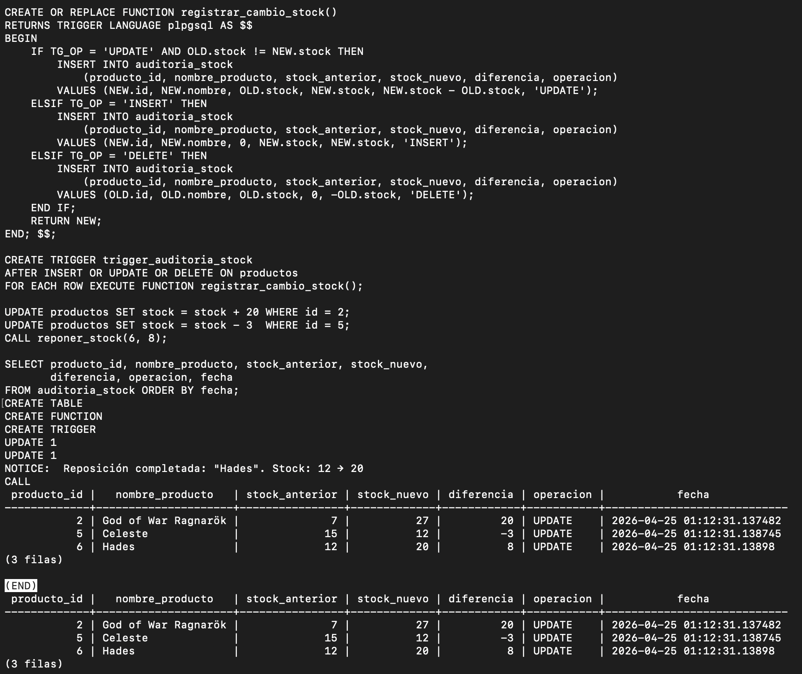
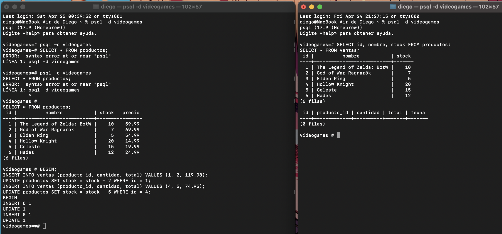
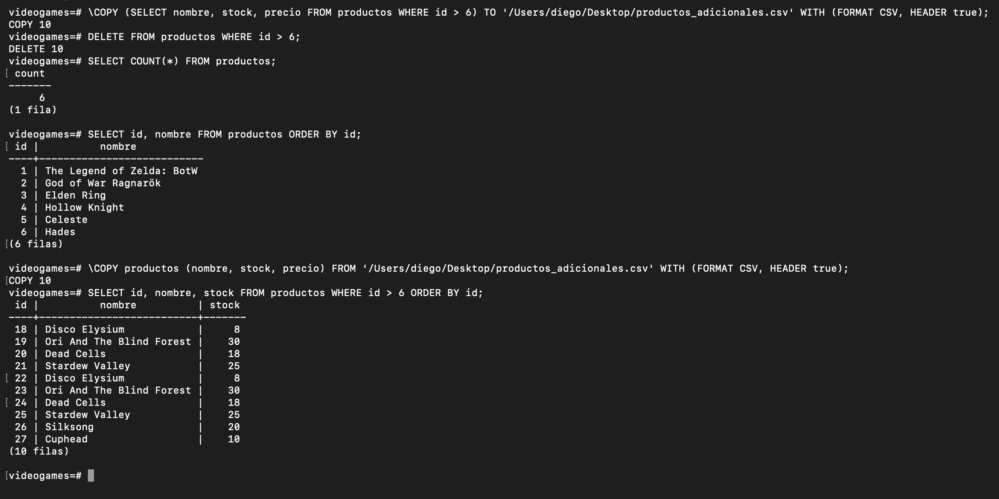

<div align="center">


# PostgreSQL Avanzado

**PL/pgSQL · Transacciones ACID · Backups y Restauración**

</div>

---

Colección de tres trabajos prácticos del módulo **Bases de Datos** del ciclo DAM. Cada uno cubre un área avanzada de PostgreSQL con ejemplos reales, capturas de ejecución y explicaciones detalladas.

---

## Contenido

| # | Módulo | Temas |
|---|---|---|
| 01 | [PL/pgSQL](#01--programación-en-plpgsql) | Variables, condicionales, bucles, funciones, procedimientos, triggers |
| 02 | [Transacciones](#02--transacciones-acid) | BEGIN, COMMIT, ROLLBACK, aislamiento, manejo de errores |
| 03 | [Backups](#03--backups-y-restauración) | pg_dump, pg_restore, COPY, automatización |

---

## 01 · Programación en PL/pgSQL

[`01-programacion-plpgsql/`](01-programacion-plpgsql/)

PL/pgSQL es el lenguaje de procedimientos de PostgreSQL. Permite escribir lógica de negocio directamente en la base de datos: variables tipadas, estructuras de control, funciones reutilizables y triggers automáticos.

**Conceptos cubiertos:**

- Bloques anónimos `DO $$ ... $$`
- Variables y tipos (`%TYPE`, `%ROWTYPE`)
- Condicionales `IF / ELSIF / ELSE` y `CASE`
- Bucles `WHILE` y `FOR`
- Funciones con `RETURNS` y `RETURNS TABLE`
- Procedimientos almacenados `CREATE PROCEDURE`
- Triggers `BEFORE` y `AFTER` con `NEW` / `OLD`

**Ejemplo — trigger de auditoría:**

```sql
CREATE OR REPLACE FUNCTION auditar_cambio()
RETURNS TRIGGER AS $$
BEGIN
    INSERT INTO auditoria (tabla, operacion, datos_anteriores, fecha)
    VALUES (TG_TABLE_NAME, TG_OP, row_to_json(OLD), NOW());
    RETURN NEW;
END;
$$ LANGUAGE plpgsql;

CREATE TRIGGER tr_auditoria
AFTER UPDATE OR DELETE ON productos
FOR EACH ROW EXECUTE FUNCTION auditar_cambio();
```

<div align="center">
  
  <p><em>Trigger de auditoría registrando cambios automáticamente</em></p>
</div>

---

## 02 · Transacciones ACID

[`02-transacciones-postgresql/`](02-transacciones-postgresql/)

Una transacción agrupa operaciones SQL en una unidad indivisible: o todo tiene éxito, o nada se aplica. PostgreSQL garantiza las propiedades **ACID** en todas sus transacciones.

| Propiedad | Significado |
|---|---|
| **A**tomicity | Todo o nada — si falla una operación, se deshacen todas |
| **C**onsistency | La BD pasa de un estado válido a otro estado válido |
| **I**solation | Las transacciones concurrentes no se interfieren |
| **D**urability | Un COMMIT persiste aunque el sistema falle |

**Conceptos cubiertos:**

- Flujo `BEGIN → COMMIT / ROLLBACK`
- Comportamiento ante errores y excepciones
- Aislamiento entre sesiones concurrentes (Terminal A vs Terminal B)
- `SAVEPOINT` y rollback parcial
- Triggers dentro de transacciones

**Ejemplo — transferencia atómica:**

```sql
BEGIN;
    UPDATE cuentas SET saldo = saldo - 500 WHERE id = 1;
    UPDATE cuentas SET saldo = saldo + 500 WHERE id = 2;
COMMIT;
-- Si cualquiera de las dos falla → ROLLBACK automático
```

<div align="center">
  
  <p><em>Aislamiento: la Terminal B no ve los cambios hasta que A hace COMMIT</em></p>
</div>

---

## 03 · Backups y Restauración

[`03-backups-postgresql/`](03-backups-postgresql/)

Un backup es una fotografía de la base de datos en un momento concreto. Sin backups, cualquier accidente es catastrófico. Este módulo cubre las herramientas nativas de PostgreSQL para proteger los datos.

**Herramientas cubiertas:**

| Herramienta | Uso |
|---|---|
| `pg_dump` | Exportar una base de datos a SQL o binario |
| `pg_restore` | Restaurar desde formato binario |
| `psql` | Restaurar desde SQL plano |
| `COPY` | Exportar / importar datos como CSV |

**Conceptos cubiertos:**

- Backup completo en formato SQL y binario
- Restauración en base de datos nueva
- Exportación e importación de tablas con CSV
- Automatización con funciones programadas

```bash
# Backup completo
pg_dump -U postgres -d tienda -f backup_tienda.sql

# Restaurar
psql -U postgres -d tienda_nueva -f backup_tienda.sql

# Exportar tabla como CSV
\COPY productos TO 'productos.csv' WITH CSV HEADER;
```

<div align="center">
  
  <p><em>Flujo completo: backup → restauración → verificación</em></p>
</div>

---

## Estructura del repositorio

```
postgresql-avanzado/
├── 01-programacion-plpgsql/
│   ├── 01_programacion_postgresql.md   # Guía completa con ejemplos
│   └── capturas/                       # Capturas de ejecución real
├── 02-transacciones-postgresql/
│   ├── 02_transacciones_postgresql.md
│   └── capturas/
└── 03-backups-postgresql/
    ├── 03_backups_postgresql.md
    └── capturas/
```

---

<div align="center">

**Diego Gil** · Módulo BAE · DAM

</div>
